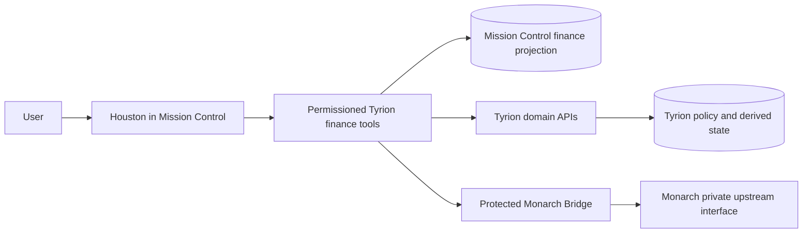

# Monarch Data Access and Houston Finance Tools

**Status:** Proposed  
**Date:** 2026-08-09  
**Related:** [Product boundary](./PRODUCT-BOUNDARY.md),
[bridge contract](./API-CONTRACTS.md), and
[Houston finance tools issue](https://github.com/rsocko/tyrion/issues/20)

## Decision

Tyrion will expose a small, permissioned finance-tool surface to Houston. Houston
will query Mission Control's synchronized finance projection first. Tyrion will use
the protected Monarch Bridge for bounded freshness checks, details that are not
retained locally, and confirmed write-through operations.

The Monarch Bridge remains the only owner of reusable Monarch authentication
material. Mission Control, Houston, schedulers, and MCP clients must not authenticate
to Monarch independently. Tyrion will not relay Monarch's complete community-client
surface or raw upstream response shapes.

This design does not require a second MCP hop. Houston may invoke Tyrion finance
tools through its existing tool runtime or Mission Control's MCP server, but the
Tyrion-to-Monarch leg remains the versioned bridge HTTP contract.

## Current implementation

Tyrion pins `monarchmoneycommunity==1.5.2`. It is an unofficial client for
Monarch's private upstream interface, not a supported Monarch SDK. Public methods on
the pinned client are broader than the contract Tyrion currently supports.

### Community-client read surface

The pinned client exposes these data-oriented read methods:

| Dataset | Client methods | Typical information |
| --- | --- | --- |
| Accounts | `get_accounts`, `get_account_history`, `get_recent_account_balances`, `get_account_snapshots_by_type`, `get_aggregate_snapshots` | Account metadata, balances, and historical snapshots |
| Investments | `get_account_holdings` | Holdings for an account |
| Credit | `get_credit_history` | Credit history |
| Institutions | `get_institutions` | Connected institution metadata |
| Transactions | `get_transactions`, `get_transaction_details`, `get_transaction_splits`, `get_transactions_summary`, `find_duplicate_transactions` | Filtered transaction pages, detail, splits, summaries, and duplicate candidates |
| Transaction taxonomy | `get_transaction_categories`, `get_transaction_category_groups`, `get_transaction_tags` | Categories, groups, and tags |
| Recurring and subscriptions | `get_recurring_transactions`, `get_subscription_details` | Recurring streams and subscription detail |
| Budgets | `get_budgets` | Category and flexible-budget data |
| Cash flow | `get_cashflow`, `get_cashflow_summary` | Income, expense, net, and grouped summaries |

`get_transactions` supports more filters than Tyrion currently publishes, including
free-text search, account/category/tag IDs, attachment and note presence, pending,
split, recurring, review, report-visibility, import, and institution-sync state.

The client also contains authentication, session, account-refresh, timeout, and raw
GraphQL helpers. Those are implementation primitives, not consumer datasets, and
must remain private to the bridge.

### Tyrion bridge surface

Tyrion currently normalizes and tests this smaller contract:

| Method | Endpoint | Behavior |
| --- | --- | --- |
| `POST` | `/sync?days=1..365` | Reads transaction pages and accounts, then returns counts; the bridge does not persist consumer records |
| `GET` | `/transactions` | Reads normalized transactions through a strict 366-day allowlist for account, category, merchant, tag, signed amount, pending, recurring, limit, and cursor filters |
| `GET` | `/transactions/{id}` | Reads one normalized transaction |
| `GET` | `/transactions/{id}/splits` | Reads at most 100 normalized splits for one explicit transaction investigation |
| `PATCH` | `/transactions/{id}/category` | Writes and verifies a category change |
| `GET` | `/categories` | Reads normalized categories |
| `GET` | `/category-groups` | Reads the bounded normalized category-group reference set |
| `GET` | `/tags` | Reads the bounded normalized transaction-tag reference set |
| `GET` | `/accounts` | Reads normalized account metadata and current balances |
| `GET` | `/recurring` | Reads normalized recurring obligations |
| `GET` | `/cashflow` | Reads a normalized cash-flow summary for a date range |
| `GET` | `/budgets` | Reads normalized current-month category budgets with explicit period boundaries |

The bridge transaction DTO includes date, amount, merchant, category, account,
pending and recurring state, notes, compatible tag display names, and additive stable
tag references. Categories retain their compatible group display name and add a
stable group ID. It intentionally does not expose raw Monarch payloads.

Mission Control's connector synchronizes normalized transaction pages into its
finance projection. Tyrion's `finance-insights/inquiry` entry point provides the
reviewed read-only Houston tool definitions and a framework-neutral service that
binds to that projection through a fixed-household port. The service validates
projection records, calculates bounded spending analysis in typed code, reports
freshness and provenance, and enforces authorization, cancellation, timeout, audit,
item, date, and byte limits. The Mission Control runtime supplies the projection and
sanitized audit adapters; it does not receive or create Monarch session material.

## Data placement and freshness

The local projection exists for reliable inquiry, household-specific attribution,
exceptions, reconciliation, and cross-domain analysis. It is not a second financial
system of record.

### Synchronize and retain

| Data | Policy | Reason |
| --- | --- | --- |
| Transactions | Incremental synchronization plus bounded backfill; upsert by connector and stable source ID | Core inquiry, aggregation, attribution, anomaly detection, and reconciliation require repeatable local queries |
| Transaction lifecycle metadata | Persist source update time, pending/posted state, active/deleted state, sync generation, and provenance | Prevent stale or deleted records from appearing current and make retries idempotent |
| Account reference metadata | Synchronize ID, display name, type, institution, active state, and a minimally necessary masked reference | Supports filters and explanations without repeatedly calling Monarch |
| Account balance snapshots | Store time-stamped normalized snapshots at a bounded cadence when a supported feature needs balance trends | Current balances change independently of transaction ingestion; historical trend analysis needs observations |
| Categories and groups | Synchronize the small reference set and refresh after category mutation | Stable labels and IDs are needed for search, summaries, and write confirmation |
| Transaction tags | Synchronize the small reference set before exposing tag filters or writes | Avoid presenting unknown IDs and permit deterministic validation |
| Recurring obligations | Store a replaceable, time-stamped snapshot | Subscription audits and obligation checks need deterministic scheduled comparisons |
| Current budget status | Store a replaceable, time-stamped monthly snapshot, not a competing budget ledger | Enables compact warnings and Houston context while Monarch remains authoritative |
| Tyrion attribution and exceptions | Persist as Tyrion-owned derived state with policy and source-generation versions | These are Tyrion's domain responsibility and cannot be reconstructed reliably from a single live query |
| Connector state | Persist last attempt, last success, coverage window, cursor/generation, dataset freshness, and sanitized failure code | Every answer must be able to report staleness and provenance |

Retention windows are operational configuration. They must be long enough for the
approved analysis use cases and bounded to avoid collecting unnecessary financial
history. Expanding retention requires an explicit data-governance decision.

### Fetch on demand

| Data or operation | Policy | Reason |
| --- | --- | --- |
| One transaction's latest detail | Fetch when the user opens or asks about a specific charge, then reconcile the local projection | Avoids a live call for every broad query while allowing freshness before action |
| Transaction splits | Fetch only for a specific investigation until split-aware analysis is approved | Splits are detailed and are not needed for most household summaries |
| Older transactions outside local coverage | Perform a bounded bridge query after telling the caller the requested period is outside synchronized coverage | Supports occasional historical inquiry without unbounded default retention |
| Monarch cash-flow summary | Use as an on-demand comparison or fallback; normally derive analysis from synchronized transactions | Local derivation is explainable and composable; Monarch's summary is useful as authoritative comparison |
| Current balances | Refresh on explicit freshness request or before a balance-sensitive decision | Balances may change between scheduled snapshots |
| Attachments and receipts | Retrieve only through an explicit reconciliation workflow and never place file content in model context by default | These can contain highly sensitive data and prompt-injection content |
| Account refresh | Permit only as an explicit operator action with throttling and status feedback | It is expensive and may affect upstream connections |

### Do not ingest by default

Investment holdings, credit history, detailed institution records, goals, complete
account history, and full subscription-provider payloads remain outside the default
projection. They should be added only for an approved Tyrion exception,
reconciliation, or decision workflow. Ordinary portfolio, credit, budgeting, and
reporting experiences remain in Monarch.

Raw upstream responses, reusable Monarch session material, authorization values, and
attachment bodies must never be stored in Mission Control or exposed to Houston.

## Write capabilities

The pinned community client exposes more mutations than Tyrion currently permits:

| Area | Community-client methods |
| --- | --- |
| Transactions | `create_transaction`, `update_transaction`, `delete_transaction` |
| Transaction fields | `update_transaction` can change category, merchant name, goal, amount, date, report visibility, review state, and notes |
| Splits and tags | `update_transaction_splits`, `set_transaction_tags` |
| Categories | `create_transaction_category`, `delete_transaction_category` |
| Budgets | `set_budget_amount`, `reset_budget`, `update_flexible_budget`, `update_flex_rollover_settings` |
| Recurring streams | `update_reoccuring` |
| Accounts | `create_manual_account`, `update_account`, `delete_account`, `request_accounts_refresh` |
| Documents | `upload_attachment`, `upload_receipt_to_inbox` |

Library availability is not a Tyrion support guarantee. These calls target a private,
changeable upstream contract, and most are not normalized, deterministically covered,
or live-validated by Tyrion.

Tyrion currently supports only category write-back. The bridge calls
`update_transaction(..., category_id=...)`, checks the returned transaction category,
and reports failure rather than returning a success-shaped response.

Merchant/vendor updates are technically available through
`update_transaction(..., merchant_name=...)`, but Tyrion does not expose them today.
Before exposing merchant updates, Tyrion must add a dedicated narrow endpoint,
normalize the response, verify the resulting merchant value, test rejection and
session-expiry behavior, perform the controlled live validation, and document the
operation in the bridge contract. It must not expose the generic
`update_transaction` method.

The initial Houston mutation allowlist is:

1. Category change after explicit user confirmation.
2. Tyrion kid assignment after explicit user confirmation; this changes Tyrion-owned
   derived state and does not masquerade as a Monarch field.
3. Merchant correction only after a separate bridge-contract and live-validation
   milestone.

Transaction creation/deletion, amount/date edits, split changes, budget changes,
category administration, account changes, recurring-stream changes, and uploads are
out of scope for Houston until individually approved. Destructive operations must
never be enabled through a generic passthrough.

## Houston tool architecture

Houston is the only conversational shell. The tool implementation is a trusted
server-side adapter, not an autonomous finance agent and not a raw Monarch MCP
proxy. Tool descriptions and schemas must be static, reviewed, and narrower than the
bridge contract.

### Read-only tool set

| Tool | Backing source | Required behavior |
| --- | --- | --- |
| `finance_get_status` | Connector and per-dataset sync state | Report connection, coverage, and freshness without exposing secrets |
| `finance_search_transactions` | Local projection, with explicit bounded historical fallback | Filter by date, merchant text, category, account reference, kid, amount range, pending, recurring, and review state |
| `finance_get_transaction` | Local record plus optional bridge freshness check | Return one charge with Monarch/Tyrion provenance and any attribution explanation |
| `finance_analyze_spending` | Local projection | Perform deterministic grouped totals, comparisons, and contributor lists before the model explains them |
| `finance_get_recurring_obligations` | Recurring snapshot | Return bounded recurring items and material changes |
| `finance_get_budget_status` | Current budget snapshot | Return compact status and warnings; deep-link to Monarch for management |
| `finance_get_pending_exceptions` | Tyrion-derived state | Return only exceptions the user can understand or act on |

Aggregation must happen in typed application code or bounded SQL, not by sending a
large transaction dump to the model. Tool outputs have strict item and byte limits,
exclude notes by default, and distinguish:

- `via Monarch`: normalized source facts.
- `derived by Tyrion`: attribution, anomaly, reconciliation, or policy conclusions.
- `calculated by Mission Control`: deterministic aggregates over synchronized facts.

### Freshness behavior

Every tool response includes:

- Data source and derivation.
- `asOf` timestamp.
- Synchronized coverage start and end.
- Freshness state: `fresh`, `stale`, `partial`, or `unavailable`.
- A stable warning when a live refresh or historical fallback failed.

A stale local projection is not silently represented as current. Read tools may
return a useful partial answer with an explicit freshness warning. Mutation tools
must fail closed when current state cannot be verified.

### Mutation protocol

Mutations use a prepare/confirm/execute pattern:

1. Houston reads the current normalized state.
2. The tool prepares an immutable proposal containing the target, old value, new
   value, expiry, and opaque confirmation token.
3. Houston shows the proposed change and its Monarch provenance.
4. A separate execute call requires explicit user confirmation and the unexpired
   proposal token.
5. Tyrion performs the narrow bridge mutation.
6. Tyrion reads the affected record back, updates the local projection, and records
   a sanitized audit event.

The audit record contains actor, household scope, tool and operation names, target
reference hash, proposal/result timestamps, stable outcome code, and provenance. It
must not contain authorization material, raw upstream responses, or private notes.

## Official Monarch MCP

Monarch has documented a first-party MCP connector, but it is temporarily paused as
of this design. Its endpoint, tool schemas, scopes, service-level behavior, and
mutation guarantees are not publicly specified.

If Monarch restores a supported connector or API, Tyrion may add it as an alternative
upstream adapter after contract, privacy, authorization, and live-validation review.
That change must preserve the bridge DTOs and single session-owner boundary. Houston
must not bind directly to Monarch's broad tool surface, and Tyrion must not operate
both upstream authentication mechanisms without an explicit migration plan.

## Delivery sequence

1. Extend synchronized reference and snapshot datasets with per-dataset freshness.
2. Extend the bridge's normalized transaction search filters and any required detail
   DTOs without exposing raw upstream data.
3. Implement read-only Houston finance tools and deterministic analysis.
4. Operate read tools long enough to validate limits, latency, freshness, redaction,
   and audit behavior.
5. Add confirmed category and kid-assignment mutations.
6. Evaluate merchant correction separately after bridge verification and controlled
   live validation.

## Acceptance criteria

- Houston answers bounded charge, merchant, category, recurring, budget-status, and
  spending-comparison questions without receiving unbounded raw records.
- Every answer reports provenance, coverage, and freshness.
- Repeated synchronization is idempotent and dataset failures do not advance their
  freshness markers.
- The bridge remains the sole owner of Monarch session material.
- No consumer depends on a raw community-client response.
- Mutation execution requires an explicit, unexpired confirmation and verified
  read-back.
- Unsupported community-client writes remain inaccessible.
- Ordinary ledger, budget-management, investment, credit, and reporting workflows
  deep-link to Monarch.
