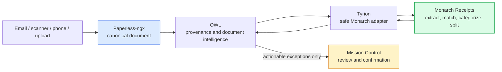
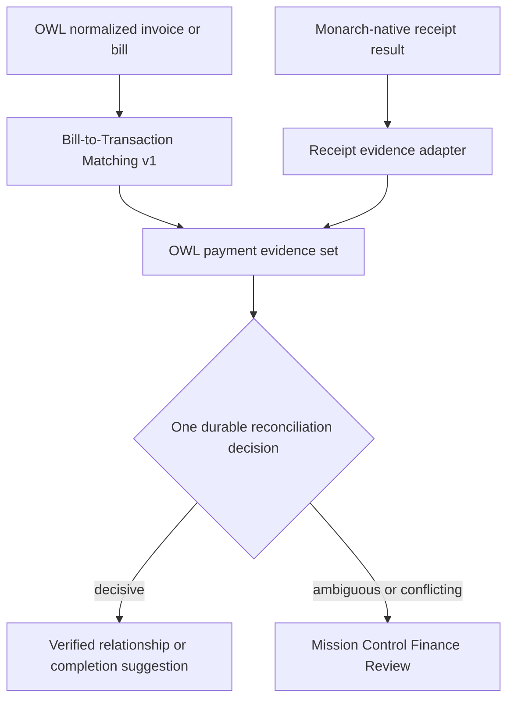
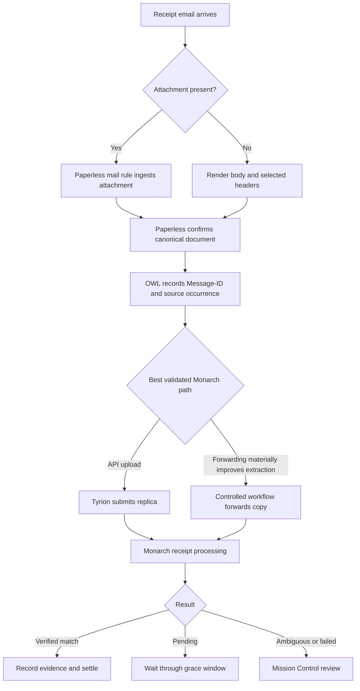
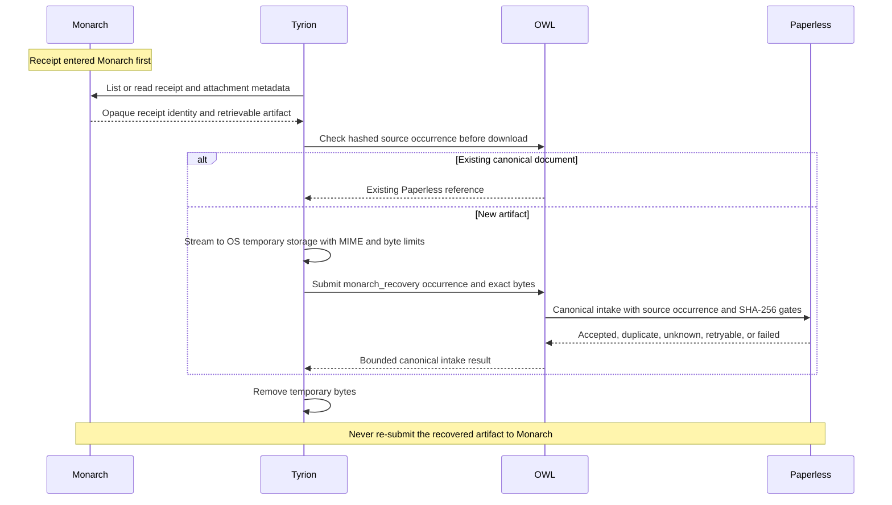
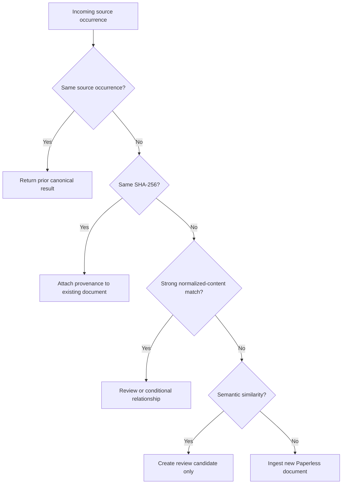
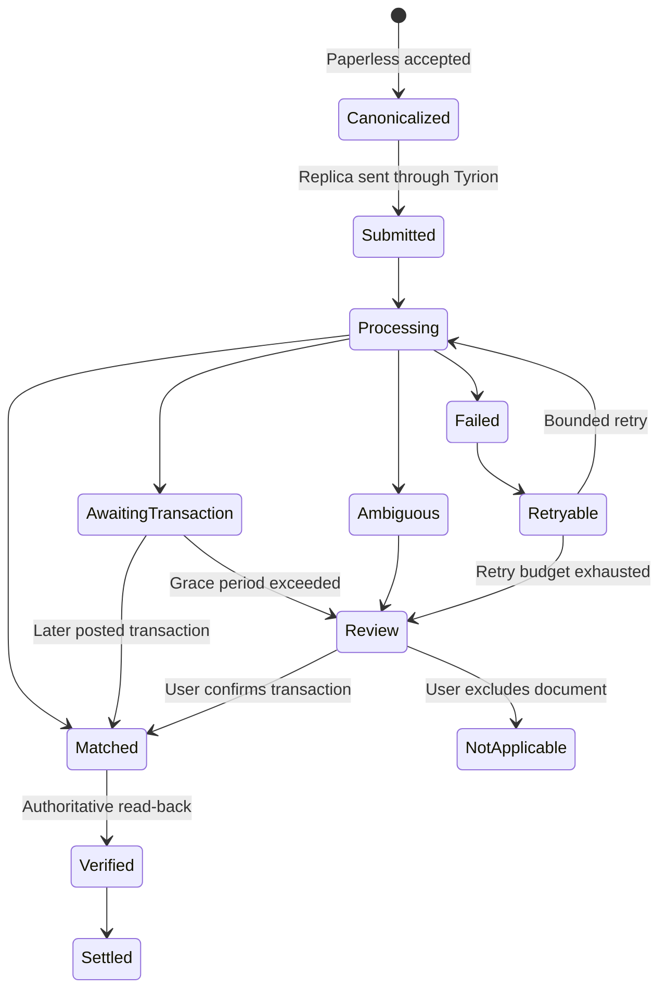
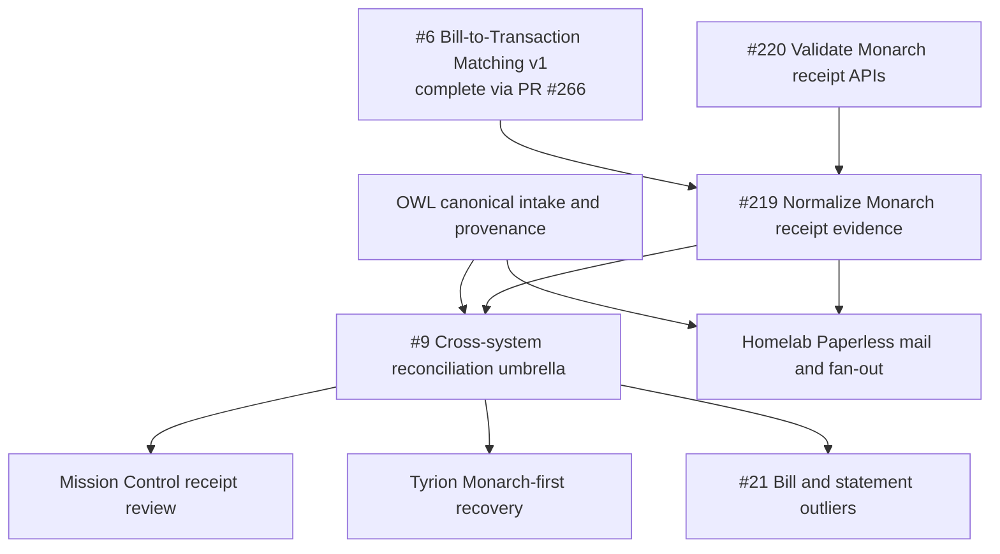

# Receipt Reconciliation Architecture

**Status:** Accepted delivery design; implementation is phased  
**Authoritative boundaries:** [PRODUCT-BOUNDARY.md](./PRODUCT-BOUNDARY.md)  
**Existing matching substrate:** [BILL-TRANSACTION-MATCHING-V1.md](./BILL-TRANSACTION-MATCHING-V1.md)

**Implemented Tyrion boundary:** The private receipt evidence v1 service consumes
OWL canonical intake from `rsocko/owl` commit
`f9f4a5801988da28a30dc7a51c18fcd60f9008f2`, persists byte-free occurrence/hash
orchestration state, and conditionally creates one controlled Monarch replica behind
default-off gates. Unknown outcomes remain queryable and are never blindly recreated.
The generated contract is
[`receipt-evidence-service-v1.openapi.json`](./receipt-evidence-service-v1.openapi.json).

## Decision

Paperless-ngx is the canonical store for original receipts, invoices, bills, order
confirmations, scans, and photos. OWL/Document Intelligence owns document
provenance, duplicate decisions, obligations, document relationships, and durable
reconciliation history. Monarch remains authoritative for transactions and its
native receipt-to-transaction processing. Tyrion mediates Monarch access and
normalizes the resulting evidence. Mission Control presents only exceptions,
confirmations, and real-world work.

The preferred direction is:



Monarch receives a controlled replica only after Paperless accepts the canonical
document. The reverse Monarch-to-Paperless direction is a recovery or backfill path
when Monarch was the first or only ingress. It is not a continuous bidirectional
file synchronization loop.

## Ownership

| Concern | Authority | Projection or replica |
| --- | --- | --- |
| Original receipt, invoice, bill, order confirmation, scan, or photo | Paperless-ngx | Optional controlled Monarch replica; no Mission Control or Tyrion archive |
| Correspondent, document type, tags, title, and archive history | Paperless-ngx | OWL reads bounded metadata |
| Source occurrence, hashes, provenance, and external-replica lifecycle | OWL | Coarse status to Mission Control |
| Obligation, document relationships, document-to-payment evidence, corrections, and audit | OWL | Privacy-bounded evidence to Tyrion and Mission Control |
| Accounts, payees, transactions, categories, splits, and native receipt match | Monarch | Normalized bounded DTOs through Tyrion |
| Candidate transaction ranking | Tyrion | Stateless result returned to OWL or Mission Control |
| Review, notification, task, My Day, and confirmation UX | Mission Control | Calls the owning system for every source mutation |
| Acquisition execution and credentials | Paperless mail, n8n, or provider connector | OWL retains only opaque connector references |

There are two related relationships:

| Relationship | Authority | Purpose |
| --- | --- | --- |
| Monarch receipt to Monarch transaction | Monarch | Native extraction, categorization, splitting, notes, and Monarch UX |
| Canonical Paperless document to transaction or obligation | OWL | Durable cross-system provenance, correction, history, and settlement |

OWL may treat a verified Monarch match as strong evidence, but records its own
relationship. A private upstream API must not be the only durable explanation for
why a document and transaction were linked.

## Relationship to Bill-to-Transaction Matching v1

The receipt design extends rather than replaces the existing
`POST /api/connector/v1/bill-matches` contract.



Bill Matching v1 already supplies:

- Normalized opaque bill and transaction references.
- Bounded transaction lookup.
- Deterministic amount, date, payee, and account signals.
- Explicit `matched`, `noMatch`, and `ambiguous` outcomes.
- Separate match and payment status.
- Sanitized failures and no document retention.

Receipt work must reuse those identities, candidate semantics, and failure rules.
It adds Monarch receipt identity, processing state, native linked-transaction
evidence, attachment provenance, and replica lifecycle. It must not introduce a
second candidate-ranking engine or a second obligation lifecycle.

## Primary intake sequence

```mermaid
sequenceDiagram
    actor U as User or source
    participant P as Paperless
    participant O as OWL
    participant T as Tyrion
    participant M as Monarch
    participant MC as Mission Control

    U->>P: Upload, scan, or email receipt
    P-->>O: Canonical document ID and accepted status
    O->>O: Record source occurrence, hash, and provenance
    O->>T: Submit eligible controlled replica
    T->>M: Upload to Monarch receipt inbox
    M-->>T: Opaque receipt identity
    loop Bounded polling
        T->>M: Read receipt status
        M-->>T: Processing, unmatched, matched, or failed
    end
    M-->>T: Linked transaction and bounded extraction result
    T-->>O: Normalized evidence without raw response or signed URL
    O->>O: Update document-to-transaction evidence
    alt Verified and non-conflicting
        O-->>MC: Settle prior attention; no global inbox item
    else Unmatched, ambiguous, conflicting, or failed
        O-->>MC: Publish one review exception
    end
```

Paperless acceptance is the commit point for the artifact. A Monarch failure does
not roll back Paperless or OWL. A Tyrion or Monarch timeout remains unknown until
the caller checks the stable source occurrence or receipt identity; it must not
blindly upload again.

## Intake decision matrix

| Situation | Direction | Behavior |
| --- | --- | --- |
| Normal email attachment | Paperless to Monarch | Paperless mail rule ingests first; OWL records message provenance; Tyrion submits a replica |
| Body-only email receipt | Paperless to Monarch | Deterministically render selected body and headers, preserve Message-ID provenance, then submit a replica |
| Scanner document | Paperless to Monarch | Scanner writes once to the consume folder; scanner job identity or exact hash is the retry key |
| Phone photo or mobile scan | Paperless to Monarch | Upload directly to Paperless; use a PDF/document scan for multiple pages |
| Manual file upload | Paperless to Monarch | Paperless accepts and hashes before any Monarch submission |
| Receipt forwarded directly to Monarch | Monarch to Paperless once | Retrieve with strict limits, deduplicate, archive in Paperless, and record Monarch origin |
| Historical Monarch-only receipt | Monarch to Paperless backfill | Import once with stable source identity and hash; do not send it back to Monarch |
| Artifact already present in both systems | Evidence only | Exchange state and relationship evidence; do not synchronize bytes |
| Monarch-generated derivative adds useful evidence | Optional Monarch to Paperless derivative | Preserve as a related derivative, never as a replacement for the original |

## Email flow

Paperless-first is the default even when Monarch's forwarded-email ingestion is
useful.



A workflow may forward a copy to Monarch after Paperless acknowledgement if
controlled validation proves that email ingestion produces materially better
results than API upload. Blind simultaneous forwarding is not preferred because it
creates race and duplicate uncertainty. Email, Paperless, Tyrion, and Monarch
credentials remain in their owning secret stores.

An order confirmation, invoice, shipping notice, revision, reminder, and payment
receipt are separate business documents even when they share one email thread.
Relate them; do not deduplicate them solely because their merchant, amount, or order
reference is similar.

## Monarch-first recovery



The optional importer is implemented as a disabled one-shot process above the
protected Bridge. It can call only receipt list, detail, and attachment-content
`GET` operations. It derives OWL's versioned `monarch_recovery` occurrence before
download, checks OWL first, and streams at most one PNG, JPEG, or PDF through
size-capped OS temporary storage while hashing. OWL owns source/hash idempotency,
Paperless submission, canonical references, attempt history, and relationships.

The worker persists only an external restart cursor and singleton lease. The cursor
contains a hashed occurrence, never a raw receipt or attachment identifier. Restart
rescans from the bounded list origin until the cursor is found; if it disappeared,
the next run safely replays because OWL owns occurrence idempotency. Completed runs
clear the cursor, so later one-shots can discover new receipts without a Tyrion
document ledger.

Every intake uses `source_channel=monarch_recovery`; OWL guarantees these results have
`external_replica_eligible=false`. The worker also exposes no Monarch create, upload,
match, unmatch, or delete client method. These two structural constraints prevent a
recovered artifact from fanning back to Monarch. Replica deletion remains a separate,
unimplemented danger action.

## Provenance and duplicate prevention

OWL should maintain a byte-free ingestion ledger:

| Field | Purpose |
| --- | --- |
| `sourceOccurrenceId` | Channel-scoped immutable identity such as mailbox + Message-ID + attachment index, scanner job, upload UUID, provider object version, or Monarch receipt version |
| `blobSha256` | Exact pre-upload bytes; an exact match safely reuses the canonical document within the deployment scope |
| `canonicalDocumentRef` | Paperless deployment fingerprint plus opaque document reference |
| `normalizedContentFingerprint` | Versioned perceptual page and normalized OCR fingerprint for rescans or transcoding |
| `semanticFingerprint` | Versioned bounded merchant, kind, reference digest, date, amount, currency, and masked account evidence |
| `externalReplicaRef` | Opaque Monarch receipt or attachment identity and replica lifecycle |
| `attemptState` | Pending, accepted, unknown, failed, or retryable intake state |
| `transformVersion` | Identifies any deterministic rendering or conversion |



Semantic similarity alone never suppresses ingestion or deletes a document.
Paperless's own duplicate response is an explicit outcome, not a success-shaped
fallback. Rejected duplicate and match proposals retain tombstones so retries do
not recreate them.

## Receipt lifecycle



| State | Mission Control behavior |
| --- | --- |
| Canonicalized, submitted, or processing | No global notification; optional related-detail status |
| Awaiting transaction | Wait through a defined grace period |
| Matched and verified | Settle prior attention and show relationship on detail |
| Ambiguous, mismatched, or conflicting | Finance Review exception |
| Failed but retryable | Automatic bounded retry |
| Retry budget exhausted | Notification; task only when real-world action is required |
| Clear, rematch, mark ineligible, or remove replica | Explicit confirmation and authoritative read-back |

A receipt match suggests completion but does not by itself close an obligation.
Posted transaction evidence, obligation policy, partial payments, and conflicting
evidence still apply. Multiple receipts may satisfy one obligation. Additional
payment evidence against a settled obligation creates double-payment review rather
than an automatic duplicate decision.

## Bounded contracts

OWL-to-Tyrion document payment evidence should contain only:

- Opaque evidence and canonical-document references.
- Normalized document kind.
- Bounded merchant or payee hint.
- Amount, currency, and document or payment date.
- Reference-presence flags or a keyed digest rather than a raw reference.
- Confidence, reason codes, match state, and `sourceAsOf`.

It must exclude OCR, filenames, email body or subject, line items unless separately
approved, raw Paperless or Monarch identifiers, signed URLs, account numbers,
credentials, and document bytes.

Tyrion returns opaque transaction or receipt references, bounded receipt state,
native linked-transaction evidence, and explainable factors. It must not expose raw
private GraphQL shapes. Existing Bill Matching v1 remains the fallback candidate
ranking path when no decisive native receipt match exists.

Mission Control receives only review DTOs: stable review identity, privacy-scoped
document summary, obligation state, match state, confidence factors, freshness,
coarse provenance channel, safe deep links, and allowlisted source actions.

## Mutations and settlement

| Action | Owner | Rule |
| --- | --- | --- |
| Confirm or replace document-to-transaction relationship | OWL | Append audit event, soft-remove prior active edge, then recompute obligation |
| Clear relationship | OWL | Remove only the active relationship; preserve both records and history |
| Attach, match, or unmatch a Monarch receipt | Monarch through Tyrion | Require idempotency, expected source revision, read-back, and validated private operation |
| Change category, merchant, or tags | Monarch through Tyrion | Use the existing normalized mutation boundary and explicit confirmation policy |
| Change transaction splits | Monarch through Tyrion | Proposed, validation-gated work requiring a separately approved versioned mutation contract |
| Remove Monarch replica | Monarch through Tyrion | Separate danger action only after canonical archive verification and live deletion validation |
| Delete canonical document | Paperless | Outside reconciliation; deep-link to the owning Paperless workflow |
| Dismiss or snooze attention | Mission Control | Local disposition only; never represent it as upstream settlement |

Mission Control shows success only after the owning system acknowledges the mutation
and an authoritative read verifies the intended state. Unknown remote outcomes remain
pending verification. Clearing a match never deletes a document or transaction.

## Security, privacy, and failure rules

- Treat document text and email content as untrusted data, never instructions.
- Document text cannot select connectors, authorize mutations, delete replicas, or
  choose external URLs.
- Keep reusable Monarch sessions solely in the Bridge-owned external session store.
- Keep Paperless, email, and workflow credentials in their owning secret stores.
- Stream temporary artifacts with strict MIME and byte limits and remove them after
  acceptance or failure.
- Never log document content, raw response bodies, signed URLs, exact identifiers,
  filenames, account references, session paths, or upstream exception text.
- Store fingerprint algorithm versions so documents can be re-evaluated safely.
- Preserve source-occurrence mappings, match decisions, tombstones, and replica
  deletion receipts longer than transient model output under an explicit retention
  policy.
- External projection failure must not roll back Paperless ingestion or OWL state.
- Replica deletion failure does not invalidate a verified document relationship.

## Delivery sequence

```mermaid
flowchart LR
    P0[0. Validate Monarch API] --> P1[1. Paperless intake and provenance]
    P1 --> P2[2. Submit and poll behind a feature gate]
    P2 --> P3[3. Combine native receipt and Bill v1 evidence]
    P3 --> P4[4. Mission Control exceptions]
    P4 --> P5[5. Monarch-first recovery importer]
    P5 --> P6[6. Email path optimization]
    P6 --> P7[7. Optional replica cleanup]
```



| Phase | Owning repository | Work | Exit criterion |
| --- | --- | --- | --- |
| 0. Private API validation | Tyrion | Deterministic contracts plus separately authorized live PNG/PDF, polling, correlation, download, match/unmatch, and deletion checks | Every operation is supported, unsupported, or rejected as too unstable |
| 1. Canonical intake and provenance | OWL + Homelab Config | Source-occurrence ledger, exact-hash gate, retry-safe Paperless ingestion, mail/scanner/photo paths, and retention | Every source resolves idempotently to one canonical Paperless document |
| 2. Feature-gated Monarch submission | Tyrion | Production decision for upstream client contribution versus isolated adapter; safe submit, poll, retrieve, and normalized DTOs | Processing and failure states are bounded, observable, and sanitized |
| 3. Reconciliation evidence | OWL + Tyrion | Reuse Bill Matching v1 candidates, add native receipt match evidence, manual correction history, partial and double-payment handling | One auditable relationship model handles bill and receipt evidence |
| 4. Review and attention | Mission Control | Receipt filter within Finance Review, source-separated evidence, notifications, confirmations, focus recovery, and settlement | Only actionable exceptions interrupt the user |
| 5. Recovery importer | Tyrion + OWL | One-time Monarch-first artifact import with stable identity, hash gate, temporary streaming, and loop prevention | Monarch-only receipts become canonical without duplicate uploads |
| 6. Email optimization | Homelab Config + Tyrion | Compare API upload with controlled forwarding after Paperless acknowledgement | Forwarding remains only if it adds measurable extraction value |
| 7. Replica cleanup | Tyrion | Optional archive verification, separately confirmed removal, and deletion receipt | Proven attachment-only deletion preserves transaction and desired match |

## GitHub work-item map

The receipt plan builds on the existing reconciliation issues rather than replacing
them:



| Work item | Role in the plan | Phase relationship |
| --- | --- | --- |
| Tyrion #6 / PR #266 | Completed stateless candidate-ranking and payment-status substrate | Completed predecessor; receipt work must reuse it |
| Tyrion #220 | Deterministic and controlled-live validation of Monarch receipt and attachment operations | Receipt Phase 0 predecessor |
| Tyrion #219 | Production decision and normalized Tyrion receipt-evidence boundary | Depends on #6 and the live conclusions from #220 |
| Tyrion #9 | Umbrella for OWL, Paperless, Tyrion, and Mission Control orchestration | Integrates owner-specific outputs; it is not a second matching implementation |
| Tyrion #21 | Specialized bill/statement outlier and mismatch workflow | Downstream consumer of #9; not a blocker for receipt intake or native Monarch matching |

Issue #9 owns cross-repository integration acceptance, not every implementation.
Source-specific work remains in its owning repository. Issue #21 retains its broader
bill and statement scope and consumes the shared identity, evidence, correction, and
settlement model after those primitives are stable.

## Controlled validation gates

Before production receipt submission, validate with invented artifacts and a
separately authorized live run:

- PNG and PDF acceptance, size limits, and rejection behavior.
- Receipt list/get pagination and processing-state transitions.
- Stable nested receipt-to-transaction identity, including pending-to-posted change.
- API upload versus forwarded-email extraction quality.
- Signed artifact URL authentication, lifetime, content type, and byte fidelity.
- Duplicate upload behavior and retry idempotency.
- Match, unmatch, rematch, and original-state restoration.
- Receipt or attachment deletion independently from transaction deletion.
- Before-and-after category, merchant, note, tag, and split state.
- Sanitized rate-limit, timeout, authentication, and unknown failure behavior.

Live tests remain excluded from normal CI, use process-only credentials, create only
invented temporary artifacts outside repositories, emit stable result codes, and
restore or remove synthetic state in `finally`.

Post-deployment validation also includes the separately gated protected-route smoke.
It runs the deployed FastAPI app in one process with the Bridge-owned client and
unchanged session lease, uses the bounded manual candidate's posted transaction only
as an opaque synthetic-match target after an exact non-redirecting posted-transaction
preflight, and reserves direct adapter access for that preflight plus reversible
relationship cleanup. Immediately before the protected synthetic match, it temporarily
unmatches only the manual relationship and verifies authoritative unlinked read-back.
In `finally`, it unmatches/deletes all synthetic receipts first, then exactly rematches
and verifies the original manual relationship under an independently reserved timeout.
It changes no manual metadata, content, or transaction and adds no browser proxy,
connector-gateway allowlist, public unmatch, or deletion endpoint. Normal Bridge/UI
callers must be stopped while the one-shot owns the lease and remain stopped whenever
cleanup or restoration is unconfirmed.

The first sanitized 2026-10-10 deployed attempt passed through synthetic download and
cleanup, but match returned
`protected_receipt_route_match_http_5xx_receipt_upstream_error` and read-back did not
run. The manual receipt remained linked to the target, making an occupied-target,
one-receipt-per-transaction constraint the bounded historical hypothesis. The earlier
matrix proved reversible unmatch/rematch and exact restoration of the candidate, but
neither the sanitized 5xx nor the reference mutation signature establishes a stable
public error classification.

After PR #282, the corrected controlled deployed run recorded
`protected_receipt_route_smoke_ok`. List, exact posted-target preflight, detail,
existing download, create, upload-poll, synthetic download, manual unmatch, match,
read-back, cleanup, and exact manual restore all passed. It used the documented
immutable deployed Bridge image and existing restricted session volume and lease,
with normal Bridge/UI callers stopped and a fresh process-only route token. No port
was published and no output was redirected. The synthetic receipt was removed and
the original manual relationship was authoritatively restored before normal services
were restarted. Post-run verification found the Bridge and operations UI running and
no one-shot receipt-route container remaining; it records container state, not a
separate Bridge health response.

This proves the bounded protected route and reversible relationship lifecycle worked
end to end with the tested deployed image and pinned client. It does not prove email
ingestion, pending-to-posted identity, untested size/page or asset-lifetime behavior,
broader concurrency, stable classification of unobserved failures, or readiness of a
production Mission Control receipt workflow.

## Non-goals

- Making Monarch a second canonical receipt archive.
- Building a Mission Control receipt inbox, gallery, OCR admin, or document browser.
- Replacing Monarch's ordinary receipt matching with a competing Tyrion algorithm.
- Replacing Bill Matching v1 with receipt-specific candidate scoring.
- Storing document bytes, OCR, signed URLs, or raw upstream receipt payloads in
  Tyrion or Mission Control.
- Automatically deleting Paperless originals or Monarch replicas during match
  confirmation.
- Treating a receipt match alone as proof that an obligation is correctly and fully
  paid.
